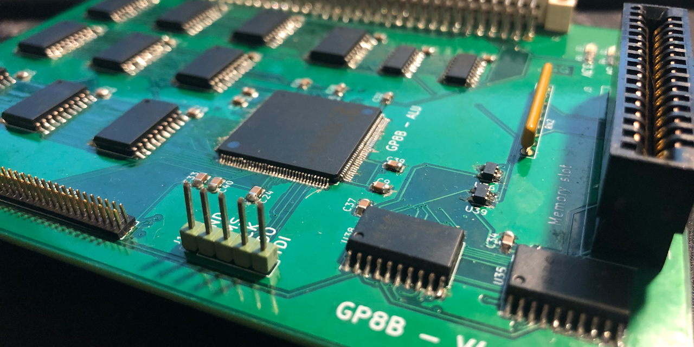
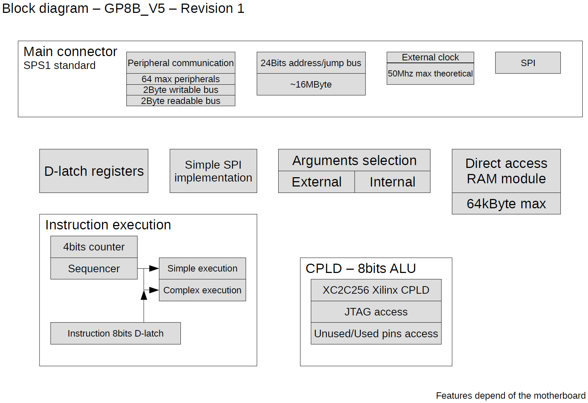

# GP8B - GProcessor8Bits

Copyright (C) 2020 Guillaume Guillet

## Description
G_Processor8Bits is a homemade, without any microcontroller, 8bits processor.



## Versions list

Actual version :
> GP8B_V4

## Block diagram

[Block diagram file](document/Block%20diagram.pdf)



## Instruction sets
8bits instuction is separated in 2 category :
```
-------------- Number selection
|||  
||| ---------- Opcode
||| |||||
000 00000
```
**5bits for opcode :**
```
0x00 = BWRITE1_CLK
0x01 = BWRITE2_CLK
0x02 = BPCS_CLK
0x03 = OPLEFT_CLK
0x04 = OPRIGHT_CLK
0x05 = OPC_CLK
0x06 = PERIPHERAL_CLK
0x07 = BJMPSRC1_CLK
0x08 = BJMPSRC2_CLK
0x09 = BJMPSRC3_CLK
0x0A = JMPSRC_CLK
0x0B = BRAMADD1_CLK
0x0C = BRAMADD2_CLK
0x0D = SPI_CLK
0x0E = BSPI_CLK
0x0F = STICK
0x10 = IF
0x11 = IFNOT
0x12 = RAMW
0x13 = UOP
0x14 = UOP
0x15 = UOP
0x16 = UOP
0x17 = LTICK
```
**3bits for number selection :**
```
0x0 = SRCVALUE
0x1 = BREAD1
0x2 = BREAD2
0x3 = OPRESULT
0x4 = RAMVALUE
0x5 = SPI
0x6 = EXT_1
0x7 = EXT_2
```

## Processor standard
This processor, follow the [SPS1](https://github.com/JonathSpirit/GComputer_standard) standard

## Compatibility
Compatible with all motherboard following the [MOM1_SPS1](https://github.com/JonathSpirit/GComputer_standard) standard

## Documents
[Block diagram file](document/Block%20diagram.pdf)

*WIP*
