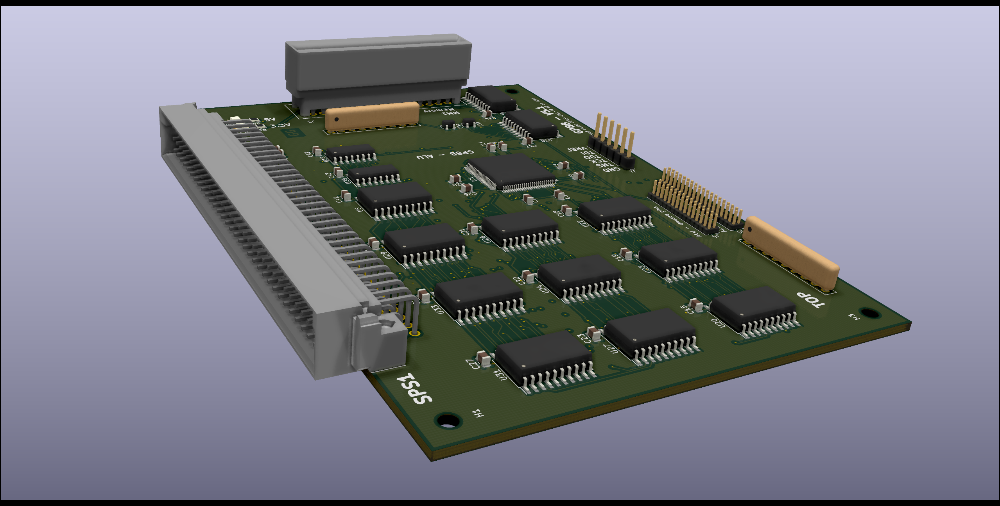

# GP8B - GProcessor8Bits

Copyright (C) 2020 Guillaume Guillet\
Licensed under CERN-OHL-W v2 or later

<table border="0px">
<tr>
<td>
This source describes Open Hardware and is licensed under the CERN-OHL-W v2 or later.
</td>
</tr>
<tr>
<td>
You may redistribute and modify this documentation and make products
using it under the terms of the CERN-OHL-W v2 (https:/cern.ch/cern-ohl).
This documentation is distributed WITHOUT ANY EXPRESS OR IMPLIED
WARRANTY, INCLUDING OF MERCHANTABILITY, SATISFACTORY QUALITY
AND FITNESS FOR A PARTICULAR PURPOSE. Please see the CERN-OHL-W v2
for applicable conditions.
</td>
</tr>
</table>

Made with [Kicad](https://kicad-pcb.org/)

## Description
G_Processor8Bits is a homemade, without any microcontroller, 8bits processor.

 
 

## Versions list

Actual version :
> GP8B_V5.0

## Block diagram

[Block diagram (.pdf)](documents/blockDiagram/GP8B_blockDiagram.pdf)


## Instruction sets
GP8B follow [CodeG_binary (revision 1)](https://github.com/JonathSpirit/GComputer_standard)

8bits instuction is separated in 2 category :
```
-------------- Argument selection
|||  
||| ---------- Opcode
||| |||||
000 00000
```
**5bits for opcode :**
```
OPCODE      HEX     NAME            DESCRIPTION
xxx0’0000   0x00    BWRITE1_CLK     Apply value to bus “write 1”.
xxx0’0001   0x01    BWRITE2_CLK     Apply value to bus “write 2”.
xxx0’0010   0x02    BPCS_CLK        Apply value to bus “peripheral CS”.
xxx0’0011   0x03    OPLEFT_CLK      Apply value to the left operation.
xxx0’0100   0x04    OPRIGHT_CLK     Apply value to the right operation.
xxx0’0101   0x05    OPCHOOSE_CLK    Apply value for choosing the operation.
xxx0’0110   0x06    PERIPHERAL_CLK  Send a clock pulse to the peripheral.
xxx0’0111   0x07    BJMPSRC1_CLK    Apply value to bus “jump source 1”.
xxx0’1000   0x08    BJMPSRC2_CLK    Apply value to bus “jump source 2”.
xxx0’1001   0x09    BJMPSRC3_CLK    Apply value to bus “jump source 3”.
xxx0’1010   0x0A    JMPSRC_CLK      Jump to the address of “jump source”.
xxx0’1011   0x0B    BRAMADD1_CLK    Apply value to bus “RAM address 1”.
xxx0’1100   0x0C    BRAMADD2_CLK    Apply value to bus “RAM address 2”.
xxx0’1101   0x0D    SPI_CLK         Send a clock pulse for the SPI.
xxx0’1110   0x0E    BCFG_SPI_CLK    Apply value to the config bus SPI.
xxx0’1111   0x0F    STICK           Simple tick, do nothing (delay).
xxx1’0000   0x10    IF              Conditional instruction.
xxx1’0001   0x11    IFNOT           Conditional instruction inverted.
xxx1’0010   0x12    RAMW            Write value to the actual address of the memory.
xxx1’0011   0x13    UOP             Undefined operation.
xxx1’0100   0x14    UOP             Undefined operation.
xxx1’0101   0x15    UOP             Undefined operation.
xxx1’0110   0x16    UOP             Undefined operation.
xxx1’0111   0x17    LTICK           Long tick, do nothing (delay).
```
**3bits for argument selection :**
```
OPCODE      HEX     NAME            DESCRIPTION
000x’xxxx   0x00    SRCVALUE        The value stored to the source.
001x’xxxx   0x20    BREAD1          The value of the read bus 1.
010x’xxxx   0x40    BREAD2          The value of the read bus 2.
011x’xxxx   0x60    OPRESULT        The value of the operation result (ALU).
100x’xxxx   0x80    RAMVALUE        The value of the processor memory.
101x’xxxx   0xA0    SPI             The value of the SPI.
110x’xxxx   0xC0    EXT_1           External value 1.
111x’xxxx   0xE0    EXT_2           External value 2.
```

## Processor standard
This processor, follow the [SPS1](https://github.com/JonathSpirit/GComputer_standard) standard

## Compatibility
Compatible with all motherboard following the [MOM1_SPS1](https://github.com/JonathSpirit/GComputer_standard) standard

## Documents
[Block diagram (.pdf)](documents/blockDiagram/GP8B_blockDiagram.pdf)

[Schematics (.pdf)](documents/GP8B_schematics.pdf)

[Materials (.pdf)](documents/GP8B_materials.pdf)

[Datasheet (.pdf)](documents/GP8B_datasheet.pdf)

## Contributing / Questions
Please see [Contributing file](CONTRIBUTING.md)
